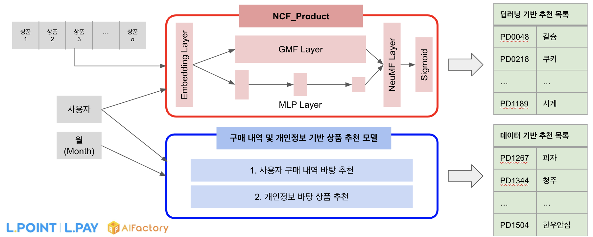
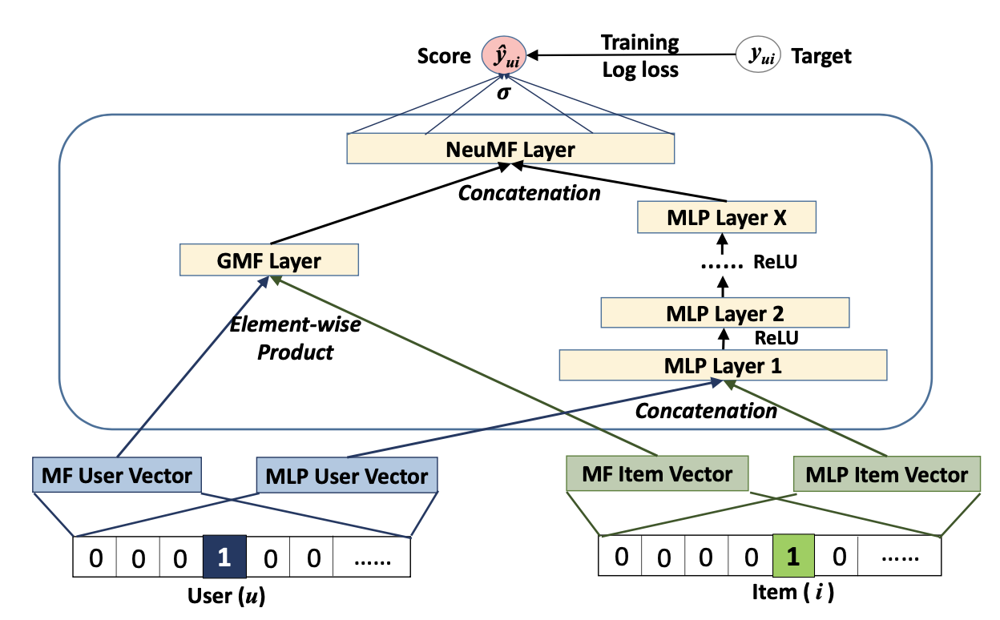

# Recommender System using NCF and Pandas
<p align='center'>

</p>

This repository holds the full Personalized Recommender System Model for the LOTTE Big Data Competition (2022.07 ~ 2022.09). I have used the **Neural Collaborative Filtering (He et al., 2017) Model**, which can be found [**here**](https://dl.acm.org/doi/10.1145/3038912.3052569). The original GitHub repository created by the authors of the paper, which is an implementation of the NCF model in Keras, can be found [**here**](https://github.com/hexiangnan/neural_collaborative_filtering).

## Introduction
<p align='center'>

</p>

The above image is the overall architecture of the NCF model. My Recommender System Model consists of two parts: (1) Product Recommender Model and (2) Service Recommender Model. Each of these models consists of two sub-components, which are the NCF and the Data-based Recommender Model. Thus, the overall structure of the model is as follows:
* Product Recommender Model
    * NCF_Product
    * Data-based Product Recommender
* Service Recommender Model
    * NCF_Service
    * Data-based Service Recommender

## Installation
Environment requirements are as follows. If your CUDA version is lower than the one mentioned here, please fully remove the CUDA package and install the required version. 
* Python 3.9 or higher
* PyTorch 1.12.0+cu102 or higher
* CUDA 11.7 or higher

1\) Create a [**Conda**](https://conda.io/projects/conda/en/latest/user-guide/install/index.html) virtual environment and activate it
```
conda create -n recsys python=3.9
conda activate recsys
```
2\) Clone repository
```
git clone https://github.com/james98kr/LOTTE_RecSys.git
cd LOTTE_RecSys
```
3\) Install dependencies
```
pip3 install torch torchvision torchaudio
pip install -r requirements.txt
```
4\) Adjust configuration file

PLEASE CHANGE the file paths of the ``yaml`` files under the  ``./configs`` directory according to your local environment. The paths must be consistent with each other. 

## Data Preparation

1\) Raw Data

After installation is complete, you must put the six raw ``csv`` files in the ``./data/raw`` directory. (However, I regret to inform that I am not permitted to provide these raw files, as they are the property of the organizers of the competition). The raw files are as follows:
* LPOINT_BIG_COMP_01_DEMO.csv
* LPOINT_BIG_COMP_02_PDDE.csv
* LPOINT_BIG_COMP_03_COP_U.csv
* LPOINT_BIG_COMP_04_PD_CLAC.csv
* LPOINT_BIG_COMP_05_BR.csv
* LPOINT_BIG_COMP_06_LPAY.csv

2\) User-Item Matrices

Then, you must execute the following commands in order to preprocess the raw data into customer-product matrix and customer-service matrix, which are required to train and test the NCF_Product and NCF_Service models.
```
cd data
python data_preprocessing.py
```
This will create two ``.npy`` files under the ``./data/matrix`` directory. If you already have the preprocessed matrices, you can simply put the two files under the ``./data/matrix`` directory. 

## Training the NCF Models

After data preparation is completed, move your current directory to the parent directory. You can train the two NCF models through the following steps.

1\) Training ``NCF_Product``

You can train the ``NCF_Product`` model with the following command:
```
python ncf_product_train.py ./configs/ncf_product_config.yaml
```
This will create a ``ncf_product.pth`` model file under the ``./save`` directory. 

2\) Training ``NCF_Service``

You can train the ``NCF_Service`` model with the following command:
```
python ncf_service_train.py ./configs/ncf_service_config.yaml
```
This will create a ``ncf_service.pth`` model file under the ``./save`` directory. 

## Testing the NCF Models

After training the two NCF models and saving the ``.pth`` files, you can test the performance of the models through the following steps. 10% of all the data in the customer-product matrix as well as the customer-service matrix are used as the test(validation) set in this step. 

1\) Testing ``NCF_Product``

You can test the ``NCF_Product`` model with the following command:
```
python ncf_product_test.py ./configs/ncf_product_config.yaml
```

2\) Testing ``NCF_Service``

You can test the ``NCF_Service`` model with the following command:
```
python ncf_service_test.py ./configs/ncf_service_config.yaml
```
By testing the performance of these files, you can check the confusion matrix (true positive/negative, false positive/negative) of the model, as well as the following:
* Precision
* Recall
* Accuracy
* F1-Score

## Inference on the Full Personalized Recommender System Model

After data preprocessing as well as training/testing the two NCF models, you are now prepared to make inferences using the full Personalized Recommender System Model. You must use the following command:
```
python recsys.py ./configs/recsys.yaml --customer {Customer ID} --month {Month} --recnum {Length of Rec. List.}
```
There are three arguments in this command:
* customer (required): You MUST pass the customer ID as argument. Otherwise, the model will return an error.
* month (optional): You can pass the month as an integer (e.g. 10 for October, 3 for March). If you don't pass the month argument, the system will automatically fill in the month based on the current date. 
* recnum (optional): You can pass the length of the recommendation list. By default, it is set to 50. If you want a shorter recommendation list, you can manually reduce this number. 